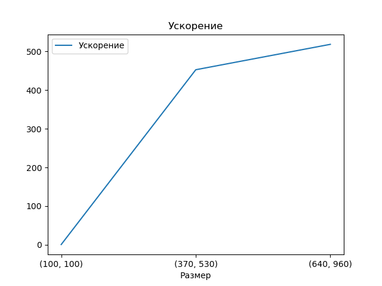
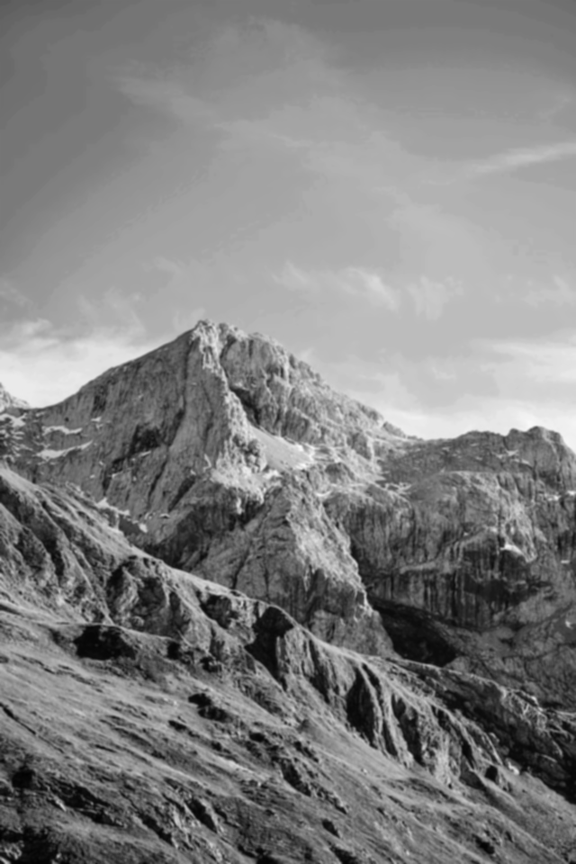

# Лабораторная работая  "Bilateral"
## Задача: 
- Реализовать билатеральный фильтр Язык: C++ или Python. 
    - Входные данные: изображение с различными разрешением. 
    - Выходные данные: проверка корректности  + время вычисления.
    - Характеристика системы: 
        - 1. видеокарта: GeForse GTX 3070 Ti Laptop;
        - 2. процессор: Core i7-12700H. 

В данной лабораторной работе производился запуск программы для обработки изображения с использованием технологии CUDA. В программе необходимо применить билатеральный фильтрна изображениях с различными разрешениями. Измерения проводились на размерностях GridDim (16, 16) и BlockDim(16, 16). Использовалась библиотека numba. 
Задачи распараллеливание на CUDA:
1. считывание фото на CPU;
2. переброска матрицы на GPU;
3. расчет на GPU;
4. переброска результата на CPU.   

Картинки на CPU:

 

 

 

Картинки на GPU:

 

 

