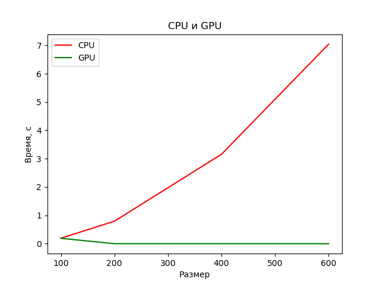
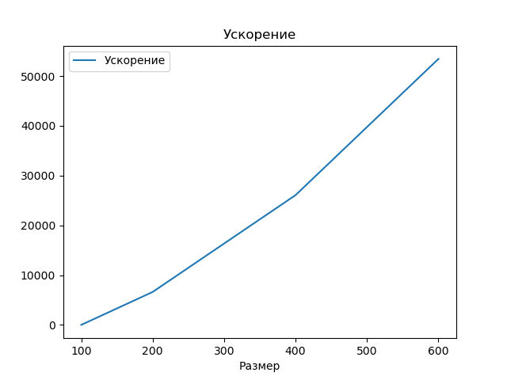

# Лабораторная работая  "bilinear"
## Задача: 
- Реализовать bilinear. Язык: C++ или Python. 
    - Входные данные: изображение с различными разрешением. 
    - Выходные данные: изображение с различными разрешением.
    - Характеристика системы: 
        - 1. видеокарта: GeForse GTX 3070 Ti Laptop;
        - 2. процессор: Core i7-12700H. 

В данной лабораторной работе производился запуск программы для обработки изображения с использованием технологии CUDA. В программе необходимо применить билатеральный фильтрна изображениях с различными разрешениями. Использовалась библиотека numba. 
Задачи распараллеливание на CUDA:
1. считывание фото на CPU;
2. переброска матрицы на GPU;
3. расчет на GPU;
4. переброска результата на CPU.

   

100Х100 -> 200X200:

600Х600 -> 1200X1200:

